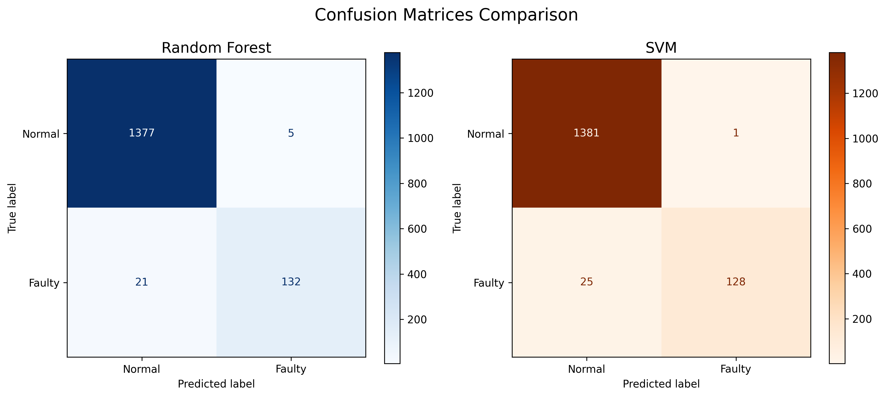

# Equipment Anomaly Detection using Machine Learning


A comparative analysis of Random Forest and SVM for predictive maintenance in biomedical equipment. Developed for the *Conditional Monitoring of Intelligent Machines* module (Biomedical Engineering).

---

## Table of Contents
1. [Project Overview](#project-overview)
2. [Key Features](#key-features)
3. [Installation](#installation)
4. [Usage](#usage)
5. [Dataset](#dataset)
6. [Methodology](#methodology)
7. [Results](#results)
8. [Discussion](#discussion)
9. [Contributing](#contributing)
10. [License](#license)
11. [Contact](#contact)

---

## Project Overview
This project implements two machine learning models (**Random Forest** and **SVM**) to detect equipment anomalies from sensor data. Designed for biomedical engineers, it addresses:
- Early fault detection in medical devices
- Comparative analysis of ML algorithms
- Feature importance interpretation

**Target Application**: Conditional monitoring of hospital equipment (e.g., ventilators, MRI machines).

---

## Key Features
- **Data Preprocessing**: Automatic scaling and train-test splitting
- **Model Comparison**: Side-by-side evaluation using 4 metrics
- **Visual Analytics**: Feature importance plots and metric comparisons

---

## Installation

### Prerequisites
- Python 3.8+
- pip ≥ 21.0

### Setup
```bash
# Clone repository
git clone https://github.com/Kakunguwo/equipment_detection_anormally.git
cd equipment_detection_anormally

# Install dependencies
pip install -r requirements.txt
```

---

## Usage

### Running the Notebook
```bash
jupyter notebook notebooks/lab.ipynb
```

### Command Line Execution
#### Run complete analysis with both models (default)
```bash
python src/main.py
```
#### Run specific models
```bash
python src/main.py --model rf           # Random Forest only
python src/main.py --model svm          # SVM only
python src/main.py --model all          # Both models (same as default)
```
---

## Dataset

### Data Description
| Feature | Unit | Normal Range |
|---------|------|--------------|
| Temperature | °C | 10-150 |
| Pressure | psi | 3-80 |
| Vibration | g | -0.5 to 5.0 |
| Humidity | %RH | 10-90 |

### Class Distribution
- **Normal**: 6,907 samples (90%)
- **Faulty**: 765 samples (10%)

### Preprocessing
- Removed metadata columns (equipment, location)
- Standardized features using StandardScaler
- Split data (80% train, 20% test)

---

## Methodology

### Algorithms
| Model | Key Parameters | Strengths |
|-------|----------------|-----------|
| Random Forest | n_estimators=100 | Handles non-linear data |
| SVM (RBF) | C=1.0, gamma='scale' | Effective for small datasets |

### Evaluation Metrics
- **Accuracy**: Overall correctness
- **Precision**: False positives minimization
- **Recall**: Fault detection sensitivity
- **F1-Score**: Harmonic mean of precision/recall

---

## Results

### Performance Comparison
| Metric | Random Forest | SVM |
|--------|---------------|-----|
| Accuracy | 0.980 | 0.984 |
| Precision | 0.980 | 0.984 |
| Recall | 0.980 | 0.984 |
| F1-Score | 0.980 | 0.984 |

### Visualizations

*Fig 1: SVM shows better fault detection (lower false negatives)*

---

## Discussion

### Biomedical Implications
- **SVM Recommended** for critical systems where missed faults are unacceptable
- **RF Recommended** for diagnostic dashboards (feature importance)

### Limitations
- Class imbalance may require oversampling
- Limited to 4 sensor types (expandable)

---

## Contributing
1. Fork the repository
2. Create a feature branch (`git checkout -b feature/improvement`)
3. Submit a Pull Request

---

## License
MIT License. See [LICENSE](LICENSE) for details.

---

## Contact
- **Author**: Ronnie Kakunguwo
- **Co-Authors**: Munashe Dube, Theophelous Manyere, Ratidzo Munyikwa, Brandon Mubairatsunga, Tariro Chidziva, Fransinca Gombani, Chido Mujuru, Nicola Kitumetsi Chiware
- **Email**: kakunguwo.ron@gmail.com
- **Department**: Biomedical Engineering, University of Zimbabwe